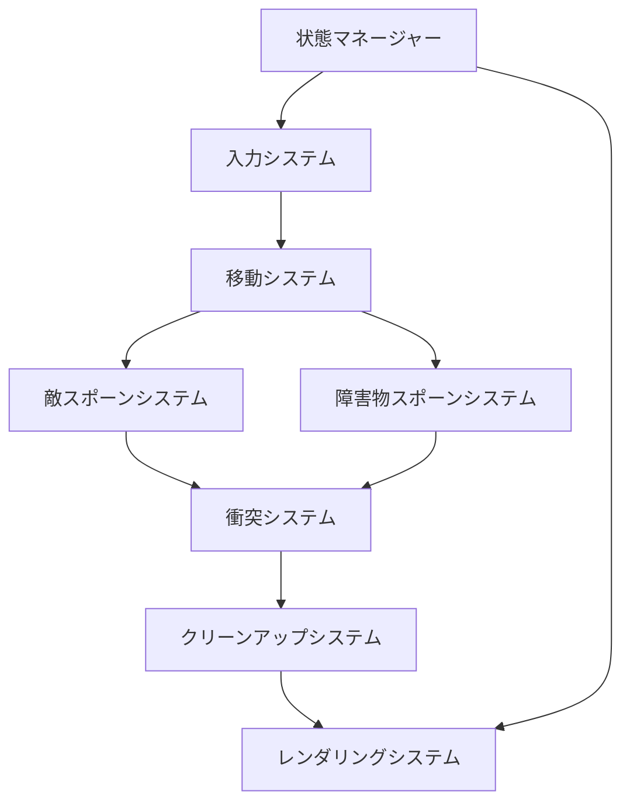

# オジサンインベーダー - 技術仕様書

## 目次

1. [プロジェクト概要と目的](#プロジェクト概要と目的)
2. [ゲームデザイン仕様](#ゲームデザイン仕様)
3. [技術アーキテクチャ](#技術アーキテクチャ)
4. [実装詳細](#実装詳細)
5. [品質保証](#品質保証)
6. [開発ガイドライン](#開発ガイドライン)
7. [APIドキュメント](#apiドキュメント)
8. [デプロイメントと運用](#デプロイメントと運用)

---

## プロジェクト概要と目的

### ゲームコンセプトとテーマ

**オジサンインベーダー** (Ojisan Invader) は、クラシックなスペースインベーダーアーケードゲームを日本文化の独自の視点でパロディ化したレトロスタイルのブラウザゲームです。ゲームでは、中年の日本のビジネスマン（オジサン）が主人公として、ネクタイビームを発射して降下してくるキャバ嬢から身を守りながら、50万円札の障害物を避けます。

### ターゲットオーディエンスとプラットフォーム

- **主要オーディエンス**: 日本のビジネス文化とレトロゲームに親しみのある大人
- **副次オーディエンス**: ブラウザゲーム愛好家とカジュアルゲーマー
- **プラットフォーム**: HTML5 CanvasとES6モジュールをサポートするモダンブラウザ
- **デバイス**: タッチサポート付きのデスクトップコンピュータ、タブレット、モバイルデバイス

### 技術目標

- **パフォーマンス**: ターゲットデバイス全体で一貫した60fpsのゲームプレイを維持
- **アーキテクチャ**: クリーンで保守可能なECS（Entity-Component-System）アーキテクチャを実装
- **互換性**: モダンブラウザをサポート（Chrome 90+、Firefox 88+、Safari 14+、Edge 90+）
- **アクセシビリティ**: キーボードナビゲーションとレスポンシブデザイン
- **コード品質**: 包括的なテストスイートで80%以上のテストカバレッジ
- **スケーラビリティ**: 将来の機能拡張とコンテンツ更新のサポート

---

## ゲームデザイン仕様

### コアゲームプレイメカニクス

#### プレイヤーキャラクター（オジサン）
- **移動**: 矢印キー（←/→）による水平移動
- **速度**: 秒間200ピクセルの基本移動速度
- **射撃**: スペースバーでネクタイビーム弾を発射
- **発射レート**: 発射間隔0.2秒のクールダウン（最大秒間5発）
- **ライフ**: ゲームごとに3ライフ、敵や障害物に当たるとライフを失う
- **ヒットボックス**: 矩形の衝突判定エリア（32x48ピクセル）

#### 敵（キャバ嬢）
- **種類**: 
  - 通常のキャバ嬢: 100ポイント、秒間50ピクセル、射撃なし
  - ボスキャバ嬢: 500ポイント、秒間30ピクセル、射撃可能
- **移動**: 下降波パターン、水平掃引と下降進行
- **行動**: 画面端まで左右に移動し、その後1行下降
- **スポーン**: 難易度が増加する波ベースのスポーン

#### 弾丸
- **プレイヤー弾丸**: 秒間300ピクセルで上向きに移動するネクタイビーム
- **敵弾丸**: （ボス敵のみ）秒間150ピクセルで下向きに移動する弾丸
- **衝突**: プレイヤーと敵の弾丸は一撃で破壊

#### 障害物
- **種類**: 50万円札（日本の通貨障害物）
- **行動**: 秒間100ピクセルで画面上部から落下
- **効果**: 接触時にプレイヤーを破壊（ライフ1つ失う）
- **スポーン**: 頻度が増加するランダム間隔

### プレイヤーコントロールとインタラクション

#### キーボードコントロール
```
← (左矢印)        : プレイヤーを左に移動
→ (右矢印)        : プレイヤーを右に移動
スペースバー       : ネクタイビームを発射
エンター          : ゲーム開始 / ゲーム再開
エスケープ        : ゲーム一時停止（実装済みの場合）
F1               : デバッグ表示の切り替え
```

#### タッチコントロール（モバイル）
- **タッチエリア**: 移動と射撃用の仮想ボタン
- **ジェスチャーサポート**: タップで射撃、スワイプで移動
- **レスポンシブデザイン**: 異なる画面サイズに対応した適応レイアウト

### スコアシステムと進行

#### スコアリング
- **通常敵**: キャバ嬢1体倒すごとに100ポイント
- **ボス敵**: ボスキャバ嬢1体倒すごとに500ポイント
- **ボーナスポイント**: 外さずに連続ヒット（コンボシステム）
- **スコア表示**: ゲームヘッダーでのリアルタイムスコア更新

#### 進行
- **波進行**: 難易度が増加する波で敵がスポーン
- **速度増加**: 3波ごとに敵の移動速度が増加
- **スポーン率**: 時間とともに敵と障害物のスポーン率が増加
- **レベル上限なし**: 全ライフを失うまで継続プレイ

### 勝敗条件

#### ゲームオーバー条件
1. プレイヤーが全3ライフを失う
2. 敵が画面下部に到達（伝統的なインベーダールール）

#### 勝利条件
- 伝統的な「勝利」状態はなし - ハイスコア達成のためのエンドレスゲームプレイ
- 個人最高記録の追跡とスコアの永続化

### ビジュアル・オーディオデザイン要件

#### ビジュアルスタイル
- **アートスタイル**: 8ビット風グラフィックのピクセルアートレトロ美学
- **カラーパレット**: ダーク背景上のネオンカラー（シアン、マゼンタ、イエロー）
- **解像度**: レスポンシブスケーリング付きの固定800x600内部解像度
- **エフェクト**: スキャンラインオーバーレイ、グローエフェクト、レトロCRTシミュレーション

#### キャラクターデザイン
- **オジサン**: スーツ、ネクタイ、ハゲ頭のピクセル化されたビジネスマン
- **キャバ嬢**: ピンクのドレスを着たスタイライズされたホステスキャラクター
- **弾丸**: アニメーション付きの特徴的なネクタイビームデザイン
- **UI要素**: グローイングボーダー付きのレトロ・フューチャリスティックインターフェース

#### タイポグラフィ
- **プライマリフォント**: "Press Start 2P"（レトロゲームフォント）
- **セカンダリフォント**: "Orbitron"（SFスタイリング）
- **テキストエフェクト**: カラーサイクリングアニメーション付きのグローイングテキスト

#### オーディオ要件（将来の実装）
- **サウンドエフェクト**: 8ビットスタイルの射撃、爆発、移動音
- **バックグラウンドミュージック**: 日本文化要素を含むチップチューンサウンドトラック
- **オーディオエンジン**: 低遅延音声再生のためのWeb Audio API

---

## 技術アーキテクチャ

### システムアーキテクチャ概要

ゲームは、関心事の明確な分離を持つクリーンなEntity-Component-System（ECS）アーキテクチャパターンを実装しています：

```
┌─────────────────────────────────────────────────────────────┐
│                    ゲームエンジン (60fps)                   │
├─────────────────────────────────────────────────────────────┤
│  ステートマネージャー                                        │
│  ├── メニュー状態                                           │
│  ├── プレイ状態                                             │
│  └── ゲームオーバー状態                                     │
├─────────────────────────────────────────────────────────────┤
│                    ECS ワールド                              │
│  ├── エンティティマネージャー                               │
│  ├── コンポーネントストレージ                               │
│  └── システムマネージャー                                   │
├─────────────────────────────────────────────────────────────┤
│  ゲームシステム（更新順序）                                 │
│  ├── 入力システム                                           │
│  ├── 移動システム                                           │
│  ├── 敵スポーンシステム                                     │
│  ├── 障害物スポーンシステム                                 │
│  ├── 衝突システム                                           │
│  ├── クリーンアップシステム                                 │
│  └── レンダリングシステム                                   │
├─────────────────────────────────────────────────────────────┤
│  ユーティリティ                                              │
│  ├── オブジェクトプール                                     │
│  ├── アセットマネージャー                                   │
│  └── 数学ユーティリティ                                     │
└─────────────────────────────────────────────────────────────┘
```

### 技術スタックと依存関係

#### コア技術
- **JavaScript ES6+**: モジュールシステム付きのモダンJavaScript
- **HTML5 Canvas**: 2Dレンダリングとゲームグラフィック
- **CSS3**: レスポンシブスタイリングとレトロビジュアルエフェクト
- **Web API**: RequestAnimationFrame、Performance API

#### 開発依存関係
```json
{
  "devDependencies": {
    "jest": "^29.7.0",                    // ユニットテストフレームワーク
    "jest-environment-jsdom": "^29.7.0",  // テスト用DOMシミュレーション
    "jest-canvas-mock": "^2.5.1",         // Canvas APIモック
    "@playwright/test": "^1.40.0",        // E2Eテストフレームワーク
    "concurrently": "^8.2.2",             // 並列スクリプト実行
    "http-server": "^14.1.1"              // 開発サーバー
  }
}
```

#### ブラウザサポートマトリックス
| ブラウザ | 最小バージョン | 必要な機能 |
|---------|----------------|------------|
| Chrome  | 90+           | ES6モジュール、Canvas 2D |
| Firefox | 88+           | ES6モジュール、Canvas 2D |
| Safari  | 14+           | ES6モジュール、Canvas 2D |
| Edge    | 90+           | ES6モジュール、Canvas 2D |

### ECSパターン実装

#### Entity-Component-Systemアーキテクチャ
ゲームは純粋なECSアーキテクチャを使用します：

- **エンティティ**: ゲームオブジェクトの一意識別子（プレイヤー、敵、弾丸）
- **コンポーネント**: データコンテナ（Position、Velocity、Health、Sprite）
- **システム**: 特定のコンポーネントを持つエンティティを操作するロジックプロセッサ

#### ECS設計の利点
- **モジュール性**: システムは独立して動作し、簡単に修正可能
- **パフォーマンス**: 効率的なメモリレイアウトとキャッシュフレンドリーなデータアクセス
- **柔軟性**: コンポーネントを組み合わせて新しい動作を簡単に追加
- **テスト可能性**: システムとコンポーネントを分離してテスト可能

### パフォーマンス要件

#### 60fps目標
- **フレーム予算**: フレームあたり最大16.67ms
- **システム予算**: 各システムに特定の時間スライスを割り当て
- **ガベージコレクション**: オブジェクトプールによる最小化
- **最適化**: スムーズなレンダリングのための固定タイムステップと補間

#### メモリ管理
- **オブジェクトプール**: 頻繁に作成・破棄されるオブジェクトの再利用
- **コンポーネント再利用**: コンポーネントインスタンスのリセットと再利用
- **メモリ監視**: テストでの自動メモリリーク検出

#### スケーラビリティ目標
- **エンティティ数**: 60fpsで200以上のアクティブエンティティをサポート
- **衝突チェック**: フレームあたり1000以上の衝突計算
- **レンダリング操作**: フレームあたり300以上の描画呼び出し

### ブラウザ互換性要件

#### 必須機能
- ES6モジュールサポート（`import`/`export`）
- Canvas 2Dレンダリングコンテキスト
- RequestAnimationFrame API
- Performance timing API
- キーボードとタッチイベント処理

#### プログレッシブエンハンスメント
- **コア体験**: サポートされている全ブラウザでの完全なゲーム機能
- **拡張機能**: 対応ブラウザでの高度なエフェクト
- **フォールバックサポート**: 古いブラウザでの適切な機能低下

---

## 実装詳細

### ファイル構造と構成

```
ojisan-invader-app/
├── index.html              # メインHTMLエントリーポイント
├── styles.css              # グローバルスタイルとレトロテーマ
├── package.json            # プロジェクト設定と依存関係
├── playwright.config.js    # E2Eテスト設定
├── test-runner.js         # カスタムテストランナースクリプト
├── TESTING.md             # テストドキュメント
├── SPECIFICATION.md       # この仕様書
│
├── js/                    # JavaScriptソースコード
│   ├── main.js           # アプリケーションエントリーポイント
│   ├── GameEngine.js     # 固定タイムステップ付きメインゲームエンジン
│   │
│   ├── core/             # ECSコアシステム実装
│   │   ├── Entity.js     # コンポーネント管理付きエンティティクラス
│   │   ├── Component.js  # ベースコンポーネントクラス
│   │   ├── System.js     # ベースシステムクラス
│   │   └── World.js      # エンティティとシステムのワールドマネージャー
│   │
│   ├── components/       # ゲームデータコンポーネント
│   │   ├── Position.js   # 2D位置と回転
│   │   ├── Velocity.js   # 移動速度と加速度
│   │   ├── Sprite.js     # レンダリングとビジュアルプロパティ
│   │   ├── Health.js     # ヒットポイントとダメージ追跡
│   │   ├── Collision.js  # 衝突検出プロパティ
│   │   ├── Player.js     # プレイヤー固有のデータと能力
│   │   ├── Enemy.js      # 敵の行動とプロパティ
│   │   ├── Projectile.js # 弾丸の行動とダメージ
│   │   └── Obstacle.js   # 障害物プロパティ
│   │
│   ├── systems/          # ゲームロジックシステム
│   │   ├── InputSystem.js      # キーボードとタッチ入力処理
│   │   ├── MovementSystem.js   # 物理と移動更新
│   │   ├── CollisionSystem.js  # 衝突検出と応答
│   │   ├── RenderSystem.js     # グラフィックレンダリングとエフェクト
│   │   ├── EnemySpawnSystem.js # 敵波スポーンロジック
│   │   ├── ObstacleSpawnSystem.js # 障害物生成
│   │   └── CleanupSystem.js    # エンティティクリーンアップとプール
│   │
│   ├── states/           # ゲーム状態管理
│   │   ├── GameState.js     # ベース状態クラス
│   │   ├── StateManager.js  # 状態遷移管理
│   │   ├── MenuState.js     # メインメニューと説明
│   │   ├── PlayingState.js  # アクティブゲームプレイ状態
│   │   └── GameOverState.js # ゲームオーバーと再開
│   │
│   └── utils/            # ユーティリティクラスとヘルパー
│       ├── ObjectPool.js    # パフォーマンス用オブジェクトプール
│       ├── AssetManager.js  # リソース読み込みと管理
│       └── MathUtils.js     # 数学ヘルパー関数
│
└── tests/                # 包括的テストスイート
    ├── setup.js          # グローバルテスト設定
    ├── unit/             # 個別コンポーネントのユニットテスト
    ├── integration/      # システム相互作用の統合テスト
    ├── e2e/             # エンドツーエンドブラウザテスト
    ├── performance/     # パフォーマンスとベンチマークテスト
    ├── mocks/           # モックオブジェクトとテストダブル
    └── utils/           # テストユーティリティとヘルパー
```

### コアモジュールとその責任

#### ゲームエンジン（`GameEngine.js`）
```javascript
/**
 * メインゲームエンジンの責任：
 * - 固定タイムステップゲームループ（60fps目標）
 * - システム初期化と管理
 * - 状態管理統合
 * - パフォーマンス監視とデバッグ
 * - キャンバス管理とリサイズ処理
 */
class GameEngine {
  constructor(canvas) {
    this.targetFPS = 60;
    this.targetFrameTime = 1000 / this.targetFPS;
    this.world = new World();
    this.stateManager = new StateManager();
  }
  
  gameLoop() {
    // アキュムレータパターンによる固定タイムステップ
    // フレームレートに関係なく一貫した物理を保証
  }
}
```

#### ワールドマネージャー（`World.js`）
```javascript
/**
 * ECSワールドの責任：
 * - エンティティライフサイクル管理
 * - システム登録と実行
 * - コンポーネントクエリとフィルタリング
 * - パフォーマンス最適化
 */
class World {
  createEntity()              // 一意識別子で新しいエンティティを作成
  addSystem(name, system)     // 実行順序でシステムを登録
  getEntitiesWithComponents() // 効率的なコンポーネントベースクエリ
  update(deltaTime)           // 順序で全システムを更新
}
```

#### コンポーネントシステム
```javascript
/**
 * コンポーネント設計原則：
 * - 純粋なデータコンテナ（ロジックなし）
 * - セーブ/ロード機能のためのシリアライズ可能
 * - メモリ効率のためのプール可能
 * - 柔軟なエンティティ行動のための構成可能
 */

// Position Component - 空間データ
class Position extends Component {
  constructor(x = 0, y = 0, rotation = 0) {
    this.x = x;      // ワールドX座標
    this.y = y;      // ワールドY座標
    this.rotation = rotation; // ラジアンでの回転
  }
}

// Player Component - プレイヤー固有データ
class Player extends Component {
  constructor() {
    this.speed = 200;           // 移動速度（px/s）
    this.shootCooldown = 0.2;   // 発射間隔（秒）
    this.score = 0;             // 現在のスコア
    this.lives = 3;             // 残りライフ
  }
}
```

### データモデルとコンポーネント定義

#### コアコンポーネント

##### Position Component
```javascript
class Position extends Component {
  constructor(x = 0, y = 0, rotation = 0) {
    super();
    this.x = x;           // ワールドX座標（ピクセル）
    this.y = y;           // ワールドY座標（ピクセル）
    this.rotation = rotation; // ラジアンでの回転
  }
  
  // 一般的な位置操作のメソッド
  distanceTo(other) { /* 別の位置までの距離を計算 */ }
  angleTo(other) { /* 別の位置への角度を計算 */ }
  translate(dx, dy) { /* オフセットで移動 */ }
}
```

##### Velocity Component
```javascript
class Velocity extends Component {
  constructor(vx = 0, vy = 0, angularVelocity = 0) {
    super();
    this.vx = vx;                    // X速度（ピクセル/秒）
    this.vy = vy;                    // Y速度（ピクセル/秒）
    this.angularVelocity = angularVelocity; // 回転速度（ラジアン/秒）
    this.maxSpeed = 1000;            // 最大速度制限
    this.friction = 0.95;            // 摩擦係数
  }
}
```

##### Sprite Component
```javascript
class Sprite extends Component {
  constructor() {
    super();
    this.width = 32;         // スプライト幅
    this.height = 32;        // スプライト高さ
    this.color = '#FFFFFF';  // 塗りつぶし色
    this.shape = 'rectangle'; // 手続き的レンダリング用の形状タイプ
    this.visible = true;     // 可視性フラグ
    this.opacity = 1.0;      // アルファ透明度
    this.scale = 1.0;        // 統一スケール係数
    this.image = null;       // 画像アセット（テクスチャ使用時）
    this.customRender = null; // カスタムレンダリング関数
  }
}
```

##### Collision Component
```javascript
class Collision extends Component {
  constructor(width = 32, height = 32, layer = 'default') {
    super();
    this.width = width;      // 衝突ボックス幅
    this.height = height;    // 衝突ボックス高さ
    this.layer = layer;      // フィルタリング用衝突レイヤー
    this.isTrigger = false;  // トリガー vs ソリッド衝突
    this.onCollision = null; // 衝突コールバック関数
  }
}
```

#### ゲーム固有コンポーネント

##### Player Component
```javascript
class Player extends Component {
  constructor() {
    super();
    this.speed = 200;           // 移動速度（ピクセル/秒）
    this.shootCooldown = 0.2;   // 発射間隔（秒）
    this.lastShotTime = 0;      // 最後の発射タイムスタンプ
    this.score = 0;             // 現在のスコア
    this.lives = 3;             // 残りライフ
  }
  
  canShoot(currentTime) { /* プレイヤーが発射可能かチェック */ }
  recordShot(currentTime) { /* 発射タイミングを記録 */ }
  addScore(points) { /* スコアにポイントを追加 */ }
  loseLife() { /* ライフ数を減少 */ }
}
```

##### Enemy Component
```javascript
class Enemy extends Component {
  constructor(type = 'cabaret', points = 100) {
    super();
    this.type = type;           // 敵タイプ識別子
    this.points = points;       // 撃破時の獲得ポイント
    this.speed = 50;            // 移動速度
    this.direction = 1;         // 移動方向（1または-1）
    this.canShoot = false;      // 敵が発射可能かどうか
    this.shootCooldown = 2.0;   // 敵発射間隔
    this.lastShotTime = 0;      // 最後の発射タイムスタンプ
  }
  
  setType(type) { /* タイプに基づいて敵を設定 */ }
  canShootNow(currentTime) { /* 敵が発射可能かチェック */ }
}
```

### システム相互作用とワークフロー

#### ゲームループワークフロー
```
1. 入力システム
   ├── キーボード/タッチイベントを処理
   ├── プレイヤー入力状態を更新
   └── 移動コマンドを生成

2. 移動システム
   ├── 位置に速度を適用
   ├── 境界制約を処理
   └── エンティティ位置を更新

3. 敵スポーンシステム
   ├── 波進行をチェック
   ├── 新しい敵エンティティを作成
   └── 敵を編隊で配置

4. 障害物スポーンシステム
   ├── ランダム障害物生成
   ├── 障害物エンティティを作成
   └── 落下軌道を設定

5. 衝突システム
   ├── 広域衝突検出
   ├── 狭域衝突テスト
   ├── 衝突応答を処理
   └── 衝突イベントを生成

6. クリーンアップシステム
   ├── 破壊されたエンティティを削除
   ├── オブジェクトをプールに返却
   └── ガベージコレクション最適化

7. レンダリングシステム
   ├── キャンバスをクリア
   ├── エンティティを深度でソート
   ├── 全可視エンティティをレンダリング
   └── 後処理エフェクトを適用
```

#### システム依存関係


#### エンティティライフサイクル
```javascript
// エンティティ作成
const enemy = world.createEntity()
  .addComponent(new Position(100, 50))
  .addComponent(new Velocity(50, 0))
  .addComponent(new Sprite())
  .addComponent(new Enemy('cabaret', 100))
  .addComponent(new Collision(32, 32, 'enemy'));

// エンティティ処理（各フレーム）
systems.forEach(system => {
  const entities = world.getEntitiesWithComponents(system.requiredComponents);
  entities.forEach(entity => system.processEntity(entity, deltaTime));
});

// エンティティ破壊
entity.destroy(); // 削除マーク
// クリーンアップシステムが実際の削除とオブジェクトプールを処理
```

---

## 品質保証

### テスト戦略とカバレッジ要件

#### テストアーキテクチャ概要
プロジェクトは4つの異なるテストレベルを持つ包括的なテスト戦略を実装しています：

```
テストピラミッド
     /\
    /  \    E2Eテスト (5%)
   /    \   - 完全なブラウザ自動化
  /______\  - ユーザーワークフローテスト
 /        \ 
/統合テスト\ 統合テスト (15%)
\         / - システム相互作用テスト
 \________/  - ECSシステム統合
  \      /
   \    /    ユニットテスト (80%)
    \__/      - コンポーネント分離
              - システムロジックテスト
              - ユーティリティ関数テスト
```

#### カバレッジ要件としきい値

##### グローバルカバレッジ目標
```javascript
// package.json jest設定
"coverageThreshold": {
  "global": {
    "branches": 80,    // 条件分岐ロジックカバレッジ
    "functions": 80,   // 関数実行カバレッジ
    "lines": 80,       // 行実行カバレッジ
    "statements": 80   // 文実行カバレッジ
  }
}
```

##### 重要コンポーネントカバレッジ（95%以上必須）
- **ECSコアシステム**: Entity、Component、System、Worldクラス
- **ゲームエンジン**: メインゲームループと状態管理
- **衝突システム**: 物理と衝突検出ロジック
- **プレイヤーコンポーネント**: プレイヤー行動と状態管理
- **入力システム**: 制御処理とイベント処理

#### ユニットテスト実装

##### コンポーネントテスト例
```javascript
// tests/unit/components/Player.test.js
describe('Player Component', () => {
  let player;
  
  beforeEach(() => {
    player = new Player();
  });
  
  describe('射撃メカニクス', () => {
    test('クールダウン終了時に射撃を許可すべき', () => {
      const currentTime = 1000;
      player.lastShotTime = 500;
      
      expect(player.canShoot(currentTime)).toBe(true);
    });
    
    test('クールダウン中は射撃を防ぐべき', () => {
      const currentTime = 1000;
      player.lastShotTime = 950;
      
      expect(player.canShoot(currentTime)).toBe(false);
    });
  });
  
  describe('スコア管理', () => {
    test('スコアにポイントを正しく追加すべき', () => {
      player.addScore(100);
      expect(player.score).toBe(100);
      
      player.addScore(50);
      expect(player.score).toBe(150);
    });
  });
});
```

##### システムテスト例
```javascript
// tests/unit/systems/MovementSystem.test.js
describe('MovementSystem', () => {
  let world, movementSystem, entity;
  
  beforeEach(() => {
    world = new World();
    movementSystem = new MovementSystem(world);
    
    entity = world.createEntity()
      .addComponent(new Position(100, 100))
      .addComponent(new Velocity(50, -25));
  });
  
  test('速度に基づいて位置を更新すべき', () => {
    const deltaTime = 0.1; // 100ms
    movementSystem.update(deltaTime);
    
    const position = entity.getComponent(Position);
    expect(position.x).toBe(105); // 100 + (50 * 0.1)
    expect(position.y).toBe(97.5); // 100 + (-25 * 0.1)
  });
});
```

#### 統合テスト

##### ECS統合テスト例
```javascript
// tests/integration/ECS-Integration.test.js
describe('ECS System Integration', () => {
  test('完全なエンティティライフサイクルを処理すべき', () => {
    const world = new World();
    const movementSystem = new MovementSystem(world);
    const collisionSystem = new CollisionSystem(world);
    
    // 移動する弾丸を作成
    const projectile = world.createEntity()
      .addComponent(new Position(100, 100))
      .addComponent(new Velocity(0, -200))
      .addComponent(new Collision(8, 16))
      .addComponent(new Projectile('player'));
    
    // ターゲット敵を作成
    const enemy = world.createEntity()
      .addComponent(new Position(100, 80))
      .addComponent(new Collision(32, 32))
      .addComponent(new Enemy());
    
    // 1フレームをシミュレート
    movementSystem.update(0.1);  // 弾丸を上に移動
    collisionSystem.update(0.1); // 衝突をチェック
    
    // 衝突が検出され、エンティティが破壊マークされたことを確認
    expect(projectile.active).toBe(false);
    expect(enemy.active).toBe(false);
  });
});
```

#### エンドツーエンドテスト

##### ブラウザ自動化テスト
```javascript
// tests/e2e/game-flow.spec.js
const { test, expect } = require('@playwright/test');

test.describe('Game Flow', () => {
  test('完全なゲームサイクルを完了すべき', async ({ page }) => {
    await page.goto('/');
    
    // メニュー画面を確認
    await expect(page.locator('#menuScreen')).toBeVisible();
    await expect(page.locator('h2')).toContainText('オジサンインベーダー');
    
    // ゲーム開始
    await page.click('#startButton');
    await expect(page.locator('#menuScreen')).toBeHidden();
    
    // ゲームキャンバスがアクティブであることを確認
    const canvas = page.locator('#gameCanvas');
    await expect(canvas).toBeVisible();
    await expect(canvas).toBeFocused();
    
    // プレイヤーコントロールをテスト
    await page.keyboard.press('ArrowRight');
    await page.keyboard.press('Space');
    
    // ゲーム要素が現れるのを待つ
    await page.waitForTimeout(1000);
    
    // スコア更新を確認
    const score = page.locator('#score');
    await expect(score).toBeVisible();
  });
  
  test('ゲームオーバーシナリオを処理すべき', async ({ page }) => {
    await page.goto('/');
    await page.click('#startButton');
    
    // ゲームオーバーをシミュレート（ゲーム状態操作が必要）
    // 特定のキーシーケンスを送信するか、
    // ゲームオーバー状態をトリガーするJavaScriptを注入
    
    await expect(page.locator('#gameOverScreen')).toBeVisible();
    await expect(page.locator('#finalScore')).toBeVisible();
  });
});
```

#### パフォーマンステスト

##### フレームレートテスト
```javascript
// tests/performance/game-performance.test.js
describe('Performance Tests', () => {
  test('中程度のエンティティ数で60fpsを維持すべき', () => {
    const world = new World();
    const gameEngine = new GameEngine(createMockCanvas());
    
    // 50個のテストエンティティを作成
    for (let i = 0; i < 50; i++) {
      world.createEntity()
        .addComponent(new Position(Math.random() * 800, Math.random() * 600))
        .addComponent(new Velocity(Math.random() * 100, Math.random() * 100))
        .addComponent(new Sprite());
    }
    
    const frameTimes = [];
    const targetFrameTime = 16.67; // 60fps = フレームあたり16.67ms
    
    // 60フレームを測定
    for (let frame = 0; frame < 60; frame++) {
      const startTime = performance.now();
      gameEngine.update(1/60);
      const frameTime = performance.now() - startTime;
      frameTimes.push(frameTime);
    }
    
    const avgFrameTime = frameTimes.reduce((a, b) => a + b) / frameTimes.length;
    const maxFrameTime = Math.max(...frameTimes);
    
    expect(avgFrameTime).toBeLessThan(targetFrameTime * 0.8); // 予算の80%
    expect(maxFrameTime).toBeLessThan(targetFrameTime); // 予算を超えない
  });
  
  test('ゲームプレイ中にメモリリークしないべき', () => {
    const world = new World();
    const initialMemory = getMemoryUsage();
    
    // エンティティ作成/破壊による5分間のゲームプレイをシミュレート
    for (let minute = 0; minute < 5; minute++) {
      for (let second = 0; second < 60; second++) {
        // エンティティを作成・破壊
        const entity = world.createEntity();
        entity.destroy();
        world.cleanupEntities();
      }
    }
    
    const finalMemory = getMemoryUsage();
    const memoryGrowth = finalMemory - initialMemory;
    
    expect(memoryGrowth).toBeLessThan(10 * 1024 * 1024); // 10MB未満の成長
  });
});
```

### パフォーマンスベンチマーク

#### 目標パフォーマンスメトリクス

##### フレームレート要件
- **最小FPS**: 60fps持続ゲームプレイ
- **フレーム時間予算**: フレームあたり最大16.67ms
- **システム割り当て**: 
  - 入力システム: 1ms
  - 移動システム: 2ms
  - 衝突システム: 4ms
  - レンダリングシステム: 8ms
  - その他のシステム: 1.67ms

##### メモリ管理目標
- **初期メモリ**: ゲーム開始時50MB未満
- **メモリ成長**: 10分間のゲームプレイで10MB未満
- **ガベージコレクション**: コレクションあたり2ms未満の一時停止
- **オブジェクトプール効率**: 95%以上のオブジェクト再利用率

##### スケーラビリティベンチマーク
```javascript
// パフォーマンステストシナリオ
const PERFORMANCE_TARGETS = {
  entities: {
    light: { count: 50, targetFPS: 60 },
    moderate: { count: 100, targetFPS: 60 },
    heavy: { count: 200, targetFPS: 55 },
    stress: { count: 500, targetFPS: 30 }
  },
  
  collisions: {
    light: { checks: 100, maxTime: 1 },
    moderate: { checks: 500, maxTime: 2 },
    heavy: { checks: 1000, maxTime: 4 }
  }
};
```

### セキュリティ考慮事項

#### クライアントサイドセキュリティ
- **入力検証**: 全ユーザー入力とゲーム状態をサニタイズ
- **XSS防止**: ユーザー生成コンテンツをエスケープ
- **ローカルストレージ**: 機密ゲームデータ（ハイスコア）を暗号化
- **リソース読み込み**: アセット整合性を検証

#### コードセキュリティ
- **`eval()`使用禁止**: 動的コード実行を避ける
- **CSPヘッダー**: XSS保護のためのコンテンツセキュリティポリシー
- **HTTPSのみ**: 本番環境での安全なアセット読み込み
- **依存関係スキャン**: npmパッケージの定期的なセキュリティ監査

### コード品質基準

#### ESLint設定
```javascript
// .eslintrc.js
module.exports = {
  extends: ['eslint:recommended'],
  env: {
    browser: true,
    es2022: true,
    jest: true
  },
  rules: {
    'no-console': 'warn',
    'no-unused-vars': 'error',
    'prefer-const': 'error',
    'no-var': 'error'
  }
};
```

#### コードレビューチェックリスト
- [ ] 全関数にJSDocドキュメントがある
- [ ] 新機能にユニットテストが含まれている
- [ ] パフォーマンス影響が評価されている
- [ ] ハードコードされたマジックナンバーがない
- [ ] エラーハンドリングが実装されている
- [ ] メモリリークが防止されている

---

## 開発ガイドライン

### コーディング基準と規約

#### JavaScriptスタイルガイド

##### 命名規約
```javascript
// クラス: PascalCase
class GameEngine { }
class MovementSystem { }

// 関数と変数: camelCase
function updatePosition() { }
const playerSpeed = 200;

// 定数: SCREAMING_SNAKE_CASE
const MAX_ENTITIES = 1000;
const DEFAULT_CANVAS_WIDTH = 800;

// プライベートプロパティ: アンダースコアプレフィックス
class Player {
  constructor() {
    this._internalState = {};
    this.publicProperty = true;
  }
}
```

##### コード組織
```javascript
/**
 * ファイルヘッダーテンプレート
 * 
 * @fileoverview ファイル目的の簡潔な説明
 * @author 開発チーム
 * @version 1.0.0
 */

// インポートを上部に
import { Component } from '../core/Component.js';
import { MathUtils } from '../utils/MathUtils.js';

// 定数
const DEFAULT_SPEED = 100;
const MAX_HEALTH = 3;

/**
 * JSDoc付きクラスドキュメント
 * 
 * @class Player
 * @extends Component
 * @description プレイヤーキャラクターの状態と行動を管理
 */
export class Player extends Component {
  /**
   * コンストラクタドキュメント
   * @param {number} speed - プレイヤー移動速度
   * @param {number} health - 初期ヒットポイント
   */
  constructor(speed = DEFAULT_SPEED, health = MAX_HEALTH) {
    super();
    this.speed = speed;
    this.health = health;
  }

  /**
   * メソッドドキュメント
   * @param {number} currentTime - 現在のゲームタイムスタンプ
   * @returns {boolean} プレイヤーが発射可能かどうか
   */
  canShoot(currentTime) {
    return currentTime - this.lastShotTime >= this.shootCooldown;
  }
}
```

#### コンポーネント設計パターン

##### コンポーネントベースクラス
```javascript
/**
 * ベースコンポーネントクラス - 全コンポーネントがこれを継承する必要がある
 */
export class Component {
  constructor() {
    this.componentType = this.constructor.name;
    this.active = true;
  }

  /**
   * オブジェクトプール用にコンポーネントをリセット
   * サブクラスはこのメソッドをオーバーライドすべき
   */
  reset() {
    this.active = true;
  }

  /**
   * 複製用にコンポーネントをクローン
   * サブクラスはこのメソッドをオーバーライドすべき
   * @returns {Component} 新しいコンポーネントインスタンス
   */
  clone() {
    throw new Error('Clone method must be implemented by subclass');
  }
}
```

##### システムベースクラス
```javascript
/**
 * ベースシステムクラス - 全システムがこれを継承する必要がある
 */
export class System {
  constructor(world) {
    this.world = world;
    this.requiredComponents = [];
    this.enabled = true;
  }

  /**
   * エンティティフィルタリング用の必須コンポーネントを設定
   * @param {Function[]} components - コンポーネントクラスの配列
   */
  setRequiredComponents(components) {
    this.requiredComponents = components;
  }

  /**
   * システムを初期化（一度呼ばれる）
   */
  init() {
    // サブクラスでオーバーライド
  }

  /**
   * システムロジックを更新
   * @param {number} deltaTime - 前フレームからの経過時間
   */
  update(deltaTime) {
    if (!this.enabled) return;

    const entities = this.world.getEntitiesWithComponents(this.requiredComponents);
    entities.forEach(entity => this.processEntity(entity, deltaTime));
  }

  /**
   * 個別エンティティを処理
   * @param {Entity} entity - 処理するエンティティ
   * @param {number} deltaTime - 前フレームからの経過時間
   */
  processEntity(entity, deltaTime) {
    // サブクラスでオーバーライド
  }
}
```

#### エラーハンドリング基準

##### 例外処理
```javascript
/**
 * エラーハンドリングパターン
 */
class AssetManager {
  async loadImage(url) {
    try {
      const image = new Image();
      
      return new Promise((resolve, reject) => {
        image.onload = () => resolve(image);
        image.onerror = () => reject(new Error(`画像読み込み失敗: ${url}`));
        image.src = url;
      });
    } catch (error) {
      console.error('画像読み込みエラー:', error);
      return this.getPlaceholderImage(); // フォールバック
    }
  }

  getPlaceholderImage() {
    // デフォルトプレースホルダー画像を返す
    const canvas = document.createElement('canvas');
    canvas.width = 32;
    canvas.height = 32;
    const ctx = canvas.getContext('2d');
    ctx.fillStyle = '#FF00FF'; // マゼンタプレースホルダー
    ctx.fillRect(0, 0, 32, 32);
    return canvas;
  }
}
```

##### 検証とアサーション
```javascript
/**
 * 入力検証パターン
 */
function validateEntity(entity) {
  if (!entity || typeof entity !== 'object') {
    throw new Error('無効なエンティティ: オブジェクトである必要がある');
  }
  
  if (!entity.id || typeof entity.id !== 'number') {
    throw new Error('無効なエンティティ: IDが不足または無効');
  }
  
  return true;
}

function validateComponent(component) {
  if (!(component instanceof Component)) {
    throw new Error('無効なコンポーネント: Componentクラスを継承する必要がある');
  }
  
  return true;
}
```

### 開発ワークフロー

#### Gitワークフロー
```bash
# 機能開発ワークフロー
git checkout main
git pull origin main
git checkout -b feature/new-enemy-type

# 開発とテスト
npm run test:watch  # 開発中の継続的テスト
npm run dev        # ホットリロード付き開発サーバー

# コンベンショナルコミットでコミット
git add .
git commit -m "feat: 射撃能力付きボス敵タイプを追加

- 射撃メカニクス付きBossEnemyコンポーネントを実装
- 特徴的なビジュアルデザインでボス敵レンダリングを追加
- ボス敵を含むようにEnemySpawnSystemを更新
- ボス敵行動のユニットテストを追加

🤖 Generated with [Claude Code](https://claude.ai/code)

Co-Authored-By: Claude <noreply@anthropic.com>"

# 品質保証
npm run test:all    # 完全なテストスイートを実行
npm run test:e2e    # エンドツーエンドテスト

# プルリクエストを作成
git push origin feature/new-enemy-type
gh pr create --title "ボス敵タイプを追加" --body "..."
```

#### コードレビュープロセス
1. **自動チェック**: CI/CDパイプラインが全テストを実行
2. **手動レビュー**: チームメンバーがコード品質をレビュー
3. **テスト**: レビュアーが機能を手動でテスト
4. **承認**: コードが承認され、mainにマージ
5. **デプロイメント**: ステージング/本番への自動デプロイメント

#### 開発環境セットアップ
```bash
# 初期セットアップ
git clone <repository-url>
cd ojisan-invader-app
npm install

# 開発コマンド
npm run dev         # 開発サーバーとテストウォッチャーを開始
npm run serve       # HTTPサーバーのみ開始
npm run test:watch  # ウォッチモードでテストを実行
npm run test:coverage  # カバレッジレポートを生成

# 本番ビルド（ビルドシステムが追加された場合）
npm run build       # 最適化版をビルド
npm run preview     # 本番ビルドをプレビュー
```

### ビルドとデプロイメントプロセス

#### 開発サーバー
```javascript
// 開発サーバー設定（package.json）
{
  "scripts": {
    "serve": "http-server -p 8080 -c-1 --cors",
    "dev": "concurrently \"npm run serve\" \"npm run test:watch\"",
    "test:all": "npm run test && npm run test:e2e"
  }
}
```

#### 本番デプロイメント
```bash
# シンプルな静的ホスティングデプロイメント
# ファイルをWebサーバードキュメントルートにコピー
cp -r ./ /var/www/html/ojisan-invader/

# またはクラウドデプロイメントを使用
# GitHub Pages、Netlify、Vercelなど
```

#### パフォーマンス最適化
```javascript
// アセット最適化技術
const OPTIMIZATION_STRATEGIES = {
  images: 'PNGフォールバック付きWebP形式を使用',
  scripts: '本番環境でJavaScriptをバンドル・圧縮',
  css: '重要なCSSを圧縮・インライン化',
  caching: 'オフライン再生用のサービスワーカーを実装',
  cdn: '本番環境で静的アセットにCDNを使用'
};
```

### 貢献ガイドライン

#### プルリクエストテンプレート
```markdown
## 説明
行った変更の簡潔な説明。

## 変更タイプ
- [ ] バグ修正（既存機能を変更しない問題修正）
- [ ] 新機能（既存機能を変更しない機能追加）
- [ ] 破壊的変更（既存機能を変更する修正または機能）
- [ ] ドキュメント更新

## テスト
- [ ] ユニットテストを追加/更新
- [ ] 統合テストを追加/更新
- [ ] E2Eテストを追加/更新
- [ ] 手動テストを完了

## パフォーマンス影響
- [ ] パフォーマンス影響なし
- [ ] パフォーマンス改善
- [ ] パフォーマンス回帰（以下で説明）

## チェックリスト
- [ ] コードがスタイルガイドラインに従っている
- [ ] 自己レビューを完了
- [ ] ローカルでテストが通る
- [ ] ドキュメントを更新
```

#### イシューテンプレート
```markdown
## バグレポート / 機能リクエスト

### 説明
バグまたは機能リクエストの明確な説明。

### 再現手順（バグの場合）
1. '...'に移動
2. '....'をクリック
3. '....'までスクロール
4. エラーを確認

### 期待される動作
何が起こることを期待していたか。

### 実際の動作
実際に何が起こったか。

### スクリーンショット
該当する場合、スクリーンショットを追加。

### 環境
- ブラウザ: [例: Chrome 90]
- OS: [例: iOS]
- デバイス: [例: iPhone12]
```

---

## APIドキュメント

### コアクラスとインターフェース

#### Entity Class
```javascript
/**
 * Entity - コンポーネント管理付きコアECSエンティティ
 * 
 * @class Entity
 * @description コンポーネントを付けることができるゲームオブジェクトを表す
 */
class Entity {
  /**
   * @readonly
   * @type {number} 一意のエンティティ識別子
   */
  id;
  
  /**
   * @type {boolean} エンティティがアクティブで処理されるべきかどうか
   */
  active;

  /**
   * このエンティティにコンポーネントを追加
   * @param {Component} component - 追加するコンポーネントインスタンス
   * @returns {Entity} メソッドチェーン用にこのエンティティを返す
   * @throws {Error} コンポーネントが有効なComponentインスタンスでない場合
   * 
   * @example
   * const entity = world.createEntity()
   *   .addComponent(new Position(100, 200))
   *   .addComponent(new Velocity(50, 0));
   */
  addComponent(component) { }

  /**
   * クラスでコンポーネントを取得
   * @param {Function} componentClass - コンポーネントクラスコンストラクタ
   * @returns {Component|undefined} コンポーネントインスタンスまたはundefined
   * 
   * @example
   * const position = entity.getComponent(Position);
   * if (position) {
   *   console.log(`Entity at ${position.x}, ${position.y}`);
   * }
   */
  getComponent(componentClass) { }

  /**
   * エンティティが特定のコンポーネントを持っているかチェック
   * @param {Function} componentClass - チェックするコンポーネントクラス
   * @returns {boolean} コンポーネントが存在する場合true
   * 
   * @example
   * if (entity.hasComponent(Player)) {
   *   // プレイヤー固有のロジックを処理
   * }
   */
  hasComponent(componentClass) { }

  /**
   * エンティティが指定された全コンポーネントを持っているかチェック
   * @param {Function[]} componentClasses - コンポーネントクラスの配列
   * @returns {boolean} 全コンポーネントが存在する場合true
   * 
   * @example
   * const movableEntities = entities.filter(entity => 
   *   entity.hasComponents([Position, Velocity])
   * );
   */
  hasComponents(componentClasses) { }

  /**
   * エンティティからコンポーネントを削除
   * @param {Function} componentClass - 削除するコンポーネントクラス
   * @returns {boolean} コンポーネントが削除された場合true
   */
  removeComponent(componentClass) { }

  /**
   * エンティティに破壊マークを付ける
   * エンティティは次のクリーンアップサイクルで削除される
   */
  destroy() { }
}
```

#### World Class
```javascript
/**
 * World - ECSワールドマネージャー
 * 
 * @class World
 * @description エンティティとシステム管理の中央ハブ
 */
class World {
  /**
   * 新しいエンティティを作成してワールドに追加
   * @returns {Entity} 新しく作成されたエンティティ
   * 
   * @example
   * const player = world.createEntity()
   *   .addComponent(new Position(400, 500))
   *   .addComponent(new Player());
   */
  createEntity() { }

  /**
   * 既存のエンティティをワールドに追加
   * @param {Entity} entity - 追加するエンティティ
   */
  addEntity(entity) { }

  /**
   * エンティティに削除マークを付ける
   * @param {Entity} entity - 削除するエンティティ
   */
  removeEntity(entity) { }

  /**
   * システムをワールドに登録
   * @param {string} name - システム識別子
   * @param {System} system - システムインスタンス
   * 
   * @example
   * world.addSystem('movement', new MovementSystem(world));
   * world.addSystem('collision', new CollisionSystem(world));
   */
  addSystem(name, system) { }

  /**
   * 名前でシステムを取得
   * @param {string} name - システム識別子
   * @returns {System|undefined} システムインスタンス
   */
  getSystem(name) { }

  /**
   * コンポーネント要件に一致するエンティティを取得
   * @param {Function[]} componentClasses - 必須コンポーネント
   * @returns {Entity[]} 一致するエンティティの配列
   * 
   * @example
   * const movableEntities = world.getEntitiesWithComponents([Position, Velocity]);
   * const players = world.getEntitiesWithComponents([Player, Position]);
   */
  getEntitiesWithComponents(componentClasses) { }

  /**
   * 順序で全システムを更新
   * @param {number} deltaTime - 前フレームからの経過時間（秒）
   */
  update(deltaTime) { }

  /**
   * 全エンティティとシステムをクリア
   */
  clear() { }
}
```

#### GameEngine Class
```javascript
/**
 * GameEngine - 固定タイムステップ付きメインゲームエンジン
 * 
 * @class GameEngine
 * @description ゲームループ、システム、状態を管理するコアゲームエンジン
 */
class GameEngine {
  /**
   * @param {HTMLCanvasElement} canvas - ゲームキャンバス要素
   */
  constructor(canvas) { }

  /**
   * ゲームエンジンと全システムを初期化
   * @async
   * @returns {Promise<void>}
   * 
   * @example
   * const engine = new GameEngine(canvas);
   * await engine.init();
   * engine.start();
   */
  async init() { }

  /**
   * ゲームエンジンループを開始
   * 60fpsで固定タイムステップゲームループを開始
   */
  start() { }

  /**
   * ゲームエンジンを停止
   * ゲームループと更新を停止
   */
  stop() { }

  /**
   * ゲームエンジンを一時停止
   * 更新を一時停止するがレンダリングは継続
   */
  pause() { }

  /**
   * ゲームエンジンを再開
   * 一時停止状態から更新を再開
   */
  resume() { }

  /**
   * 現在のゲーム統計を取得
   * @returns {Object} パフォーマンスと状態統計
   * 
   * @example
   * const stats = engine.getStats();
   * console.log(`FPS: ${stats.fps}, Entities: ${stats.entities}`);
   */
  getStats() { }

  /**
   * エンジンをクリーンアップして破壊
   * エンジンを停止して全リソースをクリーンアップ
   */
  destroy() { }
}
```

### コンポーネント仕様

#### Position Component
```javascript
/**
 * Position Component - 空間位置データ
 * 
 * @class Position
 * @extends Component
 */
class Position extends Component {
  /**
   * @param {number} x - ワールド空間のX座標
   * @param {number} y - ワールド空間のY座標  
   * @param {number} rotation - ラジアンでの回転
   */
  constructor(x = 0, y = 0, rotation = 0) { }

  /**
   * 別の位置までの距離を計算
   * @param {Position} other - 別の位置コンポーネント
   * @returns {number} ピクセルでの距離
   */
  distanceTo(other) { }

  /**
   * 別の位置への角度を計算
   * @param {Position} other - 別の位置コンポーネント
   * @returns {number} ラジアンでの角度
   */
  angleTo(other) { }

  /**
   * オフセットで位置を移動
   * @param {number} dx - Xオフセット
   * @param {number} dy - Yオフセット
   */
  translate(dx, dy) { }
}
```

#### Sprite Component
```javascript
/**
 * Sprite Component - ビジュアルレンダリングプロパティ
 * 
 * @class Sprite
 * @extends Component
 */
class Sprite extends Component {
  constructor() {
    super();
    
    /** @type {number} ピクセルでのスプライト幅 */
    this.width = 32;
    
    /** @type {number} ピクセルでのスプライト高さ */
    this.height = 32;
    
    /** @type {string} 塗りつぶし色（CSS色文字列） */
    this.color = '#FFFFFF';
    
    /** @type {string} 手続き的レンダリング用の形状タイプ */
    this.shape = 'rectangle'; // 'rectangle', 'circle', 'triangle', 'necktie'など
    
    /** @type {boolean} 可視性フラグ */
    this.visible = true;
    
    /** @type {number} アルファ透明度（0-1） */
    this.opacity = 1.0;
    
    /** @type {number} 統一スケール係数 */
    this.scale = 1.0;
    
    /** @type {number} ラジアンでの回転 */
    this.rotation = 0;
    
    /** @type {HTMLImageElement|null} 画像アセット */
    this.image = null;
    
    /** @type {Function|null} カスタムレンダリング関数 */
    this.customRender = null;
  }
}
```

### システム仕様

#### MovementSystem
```javascript
/**
 * MovementSystem - エンティティ移動と物理を処理
 * 
 * @class MovementSystem
 * @extends System
 */
class MovementSystem extends System {
  constructor(world) {
    super(world);
    this.setRequiredComponents([Position, Velocity]);
  }

  /**
   * エンティティ移動を処理
   * @param {Entity} entity - PositionとVelocityを持つエンティティ
   * @param {number} deltaTime - 秒での時間ステップ
   * 
   * 速度に基づいて位置を更新:
   * - position.x += velocity.vx * deltaTime
   * - position.y += velocity.vy * deltaTime
   * - position.rotation += velocity.angularVelocity * deltaTime
   */
  processEntity(entity, deltaTime) { }
}
```

#### CollisionSystem
```javascript
/**
 * CollisionSystem - 衝突検出と応答を処理
 * 
 * @class CollisionSystem
 * @extends System
 */
class CollisionSystem extends System {
  constructor(world) {
    super(world);
    this.setRequiredComponents([Position, Collision]);
    this.collisionEvents = [];
  }

  /**
   * 2つのエンティティ間の衝突をチェック
   * @param {Entity} entityA - 最初のエンティティ
   * @param {Entity} entityB - 2番目のエンティティ
   * @returns {boolean} 衝突が検出された場合true
   * 
   * AABB（軸整列境界ボックス）衝突検出を使用
   */
  checkCollision(entityA, entityB) { }

  /**
   * 衝突応答を処理
   * @param {Entity} entityA - 衝突の最初のエンティティ
   * @param {Entity} entityB - 衝突の2番目のエンティティ
   * 
   * 衝突コールバックをトリガーし、応答を処理
   */
  handleCollision(entityA, entityB) { }
}
```

#### RenderSystem
```javascript
/**
 * RenderSystem - エンティティのビジュアルレンダリングを処理
 * 
 * @class RenderSystem
 * @extends System
 */
class RenderSystem extends System {
  constructor(world, canvas) {
    super(world);
    this.canvas = canvas;
    this.ctx = canvas.getContext('2d');
    this.setRequiredComponents([Position, Sprite]);
  }

  /**
   * エンティティスプライトをレンダリング
   * @param {Entity} entity - PositionとSpriteを持つエンティティ
   * @param {number} deltaTime - 時間ステップ（レンダリングでは未使用）
   * 
   * スプライトプロパティに基づいてエンティティをレンダリング:
   * - 変換を適用（位置、回転、スケール）
   * - スプライトタイプに基づいてレンダリング（画像、形状、テキスト）
   * - 透明度と可視性を処理
   */
  processEntity(entity, deltaTime) { }

  /**
   * 幾何学的形状をレンダリング
   * @param {Sprite} sprite - 形状データを持つスプライトコンポーネント
   * 
   * サポートする形状: rectangle, circle, triangle, necktie, money, ojisan, cabaret
   */
  renderShape(sprite) { }
}
```

### 設定オプション

#### ゲーム設定
```javascript
/**
 * ゲーム設定定数
 */
const GAME_CONFIG = {
  // キャンバス設定
  CANVAS_WIDTH: 800,
  CANVAS_HEIGHT: 600,
  TARGET_FPS: 60,
  
  // プレイヤー設定
  PLAYER_SPEED: 200,          // 秒間ピクセル
  PLAYER_SHOOT_COOLDOWN: 0.2, // 発射間隔（秒）
  PLAYER_LIVES: 3,
  
  // 敵設定
  ENEMY_SPEED: 50,            // 秒間ピクセル
  ENEMY_SPAWN_INTERVAL: 2.0,  // スポーン間隔（秒）
  ENEMY_POINTS: {
    cabaret: 100,
    boss_cabaret: 500
  },
  
  // 弾丸設定
  PROJECTILE_SPEED: 300,      // 秒間ピクセル
  PROJECTILE_SIZE: { width: 8, height: 16 },
  
  // 障害物設定
  OBSTACLE_SPEED: 100,        // 秒間ピクセル
  OBSTACLE_SPAWN_INTERVAL: 3.0, // スポーン間隔（秒）
  
  // パフォーマンス設定
  MAX_ENTITIES: 1000,
  OBJECT_POOL_SIZE: 200,
  
  // ビジュアル設定
  PIXEL_PERFECT: true,        // 画像スムージングを無効化
  DEBUG_RENDER: false,        // デバッグ情報を表示
  
  // 入力設定
  TOUCH_SENSITIVITY: 1.0,
  KEYBOARD_REPEAT_DELAY: 150  // ミリ秒
};
```

#### システム設定
```javascript
/**
 * システム更新順序と設定
 */
const SYSTEM_CONFIG = {
  updateOrder: [
    'input',        // ユーザー入力を処理
    'movement',     // 位置を更新
    'enemySpawn',   // 新しい敵をスポーン
    'obstacleSpawn', // 新しい障害物をスポーン
    'collision',    // 衝突をチェック
    'cleanup',      // 破壊されたエンティティを削除
    'render'        // すべてをレンダリング
  ],
  
  // システム固有設定
  collision: {
    spatialHashing: true,    // 最適化に空間ハッシュを使用
    gridSize: 64,           // 空間ハッシュのグリッドサイズ
    layers: ['player', 'enemy', 'projectile', 'obstacle']
  },
  
  render: {
    sortByDepth: false,     // エンティティは深度ソートを必要としない
    culling: true,          // 画面外エンティティをカリング
    debugDraw: false        // 衝突ボックスとデバッグ情報を描画
  }
};
```

---

## デプロイメントと運用

### システム要件

#### ブラウザ要件
| 要件 | 仕様 |
|------|------|
| **JavaScript** | モジュールサポート付きES6+（ES2015） |
| **Canvas API** | HTML5 Canvas 2Dコンテキスト |
| **Performance API** | 高解像度タイミングサポート |
| **Input API** | キーボードイベント、タッチイベント、ポインターイベント |
| **Web標準** | DOM Level 3、CSS3変換 |

#### パフォーマンス要件
| メトリクス | 最小 | 推奨 |
|-----------|------|------|
| **CPU** | デュアルコア2GHz | クアッドコア2.5GHz+ |
| **RAM** | 4GB | 8GB+ |
| **グラフィックス** | ハードウェアアクセラレーション | 専用GPU |
| **ネットワーク** | 1 Mbps | 10 Mbps+ |

#### デバイスサポート
```javascript
const DEVICE_SUPPORT = {
  desktop: {
    os: ['Windows 10+', 'macOS 10.15+', 'Linux'],
    browsers: ['Chrome 90+', 'Firefox 88+', 'Safari 14+', 'Edge 90+'],
    resolution: { min: '1024x768', recommended: '1920x1080' }
  },
  
  mobile: {
    os: ['iOS 14+', 'Android 10+'],
    browsers: ['Safari Mobile', 'Chrome Mobile', 'Firefox Mobile'],
    resolution: { min: '375x667', recommended: '414x896' }
  },
  
  tablet: {
    os: ['iPadOS 14+', 'Android 10+'],
    browsers: ['Safari', 'Chrome', 'Firefox'],
    resolution: { min: '768x1024', recommended: '1024x1366' }
  }
};
```

### インストール手順

#### ローカル開発セットアップ
```bash
# 1. リポジトリをクローン
git clone https://github.com/username/ojisan-invader-app.git
cd ojisan-invader-app

# 2. 依存関係をインストール
npm install

# 3. 開発サーバーを開始
npm run dev

# 4. ブラウザを開く
# http://localhost:8080 に移動

# 5. テストを実行（オプション）
npm run test:all
```

#### 本番デプロイメント

##### 静的ホスティング（推奨）
```bash
# オプション1: GitHub Pages
# 1. GitHubリポジトリにプッシュ
# 2. リポジトリ設定でGitHub Pagesを有効化
# 3. ソースをmainブランチに設定

# オプション2: Netlify
# 1. リポジトリをNetlifyに接続
# 2. ビルドコマンドを設定: （不要）
# 3. 公開ディレクトリを設定: ./

# オプション3: Vercel
# 1. リポジトリをVercelに接続
# 2. プッシュ時に自動デプロイ

# オプション4: 従来のWebサーバー
# ファイルをWebサーバードキュメントルートにコピー
scp -r ./* user@server:/var/www/html/ojisan-invader/
```

##### サーバー設定
```nginx
# Nginx設定例
server {
    listen 80;
    server_name ojisan-invader.example.com;
    root /var/www/html/ojisan-invader;
    index index.html;

    # gzip圧縮を有効化
    gzip on;
    gzip_types text/css application/javascript application/json;

    # 静的アセットをキャッシュ
    location ~* \.(js|css|png|jpg|jpeg|gif|ico|svg)$ {
        expires 1y;
        add_header Cache-Control "public, immutable";
    }

    # セキュリティヘッダー
    add_header X-Frame-Options "SAMEORIGIN" always;
    add_header X-Content-Type-Options "nosniff" always;
    add_header Content-Security-Policy "default-src 'self'; script-src 'self'; style-src 'self' 'unsafe-inline' fonts.googleapis.com; font-src fonts.gstatic.com;" always;

    # SPAルーティングを処理（必要な場合）
    location / {
        try_files $uri $uri/ /index.html;
    }
}
```

### 設定管理

#### 環境設定
```javascript
// config/environment.js
const ENVIRONMENTS = {
  development: {
    DEBUG: true,
    API_BASE_URL: 'http://localhost:3000',
    ANALYTICS_ENABLED: false,
    ERROR_REPORTING: false
  },
  
  staging: {
    DEBUG: false,
    API_BASE_URL: 'https://api-staging.example.com',
    ANALYTICS_ENABLED: true,
    ERROR_REPORTING: true
  },
  
  production: {
    DEBUG: false,
    API_BASE_URL: 'https://api.example.com',
    ANALYTICS_ENABLED: true,
    ERROR_REPORTING: true
  }
};

export const CONFIG = ENVIRONMENTS[process.env.NODE_ENV || 'development'];
```

#### 機能フラグ
```javascript
// config/features.js
export const FEATURE_FLAGS = {
  TOUCH_CONTROLS: true,       // モバイルタッチコントロールを有効化
  DEBUG_MODE: false,          // デバッグ情報を表示
  PERFORMANCE_MONITORING: true, // パフォーマンスメトリクスを追跡
  SOUND_EFFECTS: false,       // オーディオはまだ実装されていない
  MULTIPLAYER: false,         // 将来の機能
  ACHIEVEMENTS: false,        // 将来の機能
  LEADERBOARDS: false,        // 将来の機能
  
  // 実験的機能
  WEBGL_RENDERER: false,      // Canvas 2Dの代わりにWebGL
  PROGRESSIVE_WEB_APP: false, // PWA機能
  OFFLINE_MODE: false         // サービスワーカーキャッシュ
};
```

### 監視とメンテナンス

#### パフォーマンス監視
```javascript
// utils/PerformanceMonitor.js
export class PerformanceMonitor {
  constructor() {
    this.metrics = {
      fps: [],
      frameTime: [],
      memoryUsage: [],
      entityCount: []
    };
  }

  /**
   * パフォーマンスメトリクスを記録
   * @param {Object} gameStats - 現在のゲーム統計
   */
  recordMetrics(gameStats) {
    this.metrics.fps.push(gameStats.fps);
    this.metrics.frameTime.push(gameStats.frameTime);
    this.metrics.memoryUsage.push(this.getMemoryUsage());
    this.metrics.entityCount.push(gameStats.entities);
    
    // 最後の1000測定のみ保持
    Object.keys(this.metrics).forEach(key => {
      if (this.metrics[key].length > 1000) {
        this.metrics[key] = this.metrics[key].slice(-1000);
      }
    });
  }

  /**
   * 現在のメモリ使用量推定を取得
   * @returns {number} MBでのメモリ使用量
   */
  getMemoryUsage() {
    if (performance.memory) {
      return performance.memory.usedJSHeapSize / 1024 / 1024;
    }
    return 0;
  }

  /**
   * パフォーマンスレポートを生成
   * @returns {Object} パフォーマンスサマリー
   */
  generateReport() {
    return {
      averageFPS: this.average(this.metrics.fps),
      averageFrameTime: this.average(this.metrics.frameTime),
      peakMemoryUsage: Math.max(...this.metrics.memoryUsage),
      maxEntityCount: Math.max(...this.metrics.entityCount)
    };
  }
}
```

#### エラー監視
```javascript
// utils/ErrorReporter.js
export class ErrorReporter {
  constructor(config) {
    this.config = config;
    this.setupErrorHandlers();
  }

  setupErrorHandlers() {
    // グローバルエラーハンドラー
    window.addEventListener('error', (event) => {
      this.reportError({
        type: 'javascript',
        message: event.message,
        filename: event.filename,
        lineno: event.lineno,
        colno: event.colno,
        stack: event.error?.stack
      });
    });

    // Promise拒否ハンドラー
    window.addEventListener('unhandledrejection', (event) => {
      this.reportError({
        type: 'promise',
        message: event.reason?.message || '未処理のPromise拒否',
        stack: event.reason?.stack
      });
    });
  }

  /**
   * 監視サービスにエラーを報告
   * @param {Object} error - エラー詳細
   */
  reportError(error) {
    if (!this.config.ERROR_REPORTING) return;

    const report = {
      ...error,
      timestamp: Date.now(),
      userAgent: navigator.userAgent,
      url: window.location.href,
      gameState: this.getGameState()
    };

    // 本番環境では、エラー監視サービスに送信
    console.error('Game Error:', report);
    
    // Sentry、LogRocketなどのサービスと統合可能
    // this.sendToService(report);
  }

  getGameState() {
    if (window.ojisamInvader) {
      return window.ojisamInvader.getStats();
    }
    return null;
  }
}
```

#### アナリティクス統合
```javascript
// utils/Analytics.js
export class Analytics {
  constructor(config) {
    this.config = config;
    this.events = [];
  }

  /**
   * ゲームイベントを追跡
   * @param {string} event - イベント名
   * @param {Object} properties - イベントプロパティ
   */
  track(event, properties = {}) {
    if (!this.config.ANALYTICS_ENABLED) return;

    const eventData = {
      event,
      properties: {
        ...properties,
        timestamp: Date.now(),
        sessionId: this.getSessionId()
      }
    };

    this.events.push(eventData);
    
    // 本番環境では、アナリティクスサービスに送信
    console.log('アナリティクスイベント:', eventData);
  }

  /**
   * ゲームセッション指標を追跡
   */
  trackGameSession(sessionData) {
    this.track('game_session', {
      duration: sessionData.duration,
      score: sessionData.finalScore,
      lives_lost: sessionData.livesLost,
      enemies_defeated: sessionData.enemiesDefeated,
      level_reached: sessionData.levelReached
    });
  }

  getSessionId() {
    if (!this.sessionId) {
      this.sessionId = Math.random().toString(36).substr(2, 9);
    }
    return this.sessionId;
  }
}
```

#### メンテナンスタスク

##### 定期メンテナンスチェックリスト
- [ ] **週次**: エラーログを確認し、重要な問題を修正
- [ ] **月次**: パフォーマンス指標を確認し、ボトルネックを最適化
- [ ] **四半期**: 依存関係とセキュリティパッチを更新
- [ ] **年次**: メジャーバージョン更新とアーキテクチャレビュー

##### 自動化されたヘルスチェック
```javascript
// monitoring/healthcheck.js
export function performHealthCheck() {
  const results = {
    timestamp: Date.now(),
    checks: {}
  };

  // Canvasサポートをチェック
  results.checks.canvas = checkCanvasSupport();
  
  // JavaScript機能をチェック
  results.checks.javascript = checkJavaScriptFeatures();
  
  // パフォーマンスをチェック
  results.checks.performance = checkPerformance();
  
  // ローカルストレージをチェック
  results.checks.localStorage = checkLocalStorage();

  return results;
}

function checkCanvasSupport() {
  try {
    const canvas = document.createElement('canvas');
    const ctx = canvas.getContext('2d');
    return { supported: !!ctx, status: 'OK' };
  } catch (error) {
    return { supported: false, status: 'ERROR', error: error.message };
  }
}
```

#### バックアップと復旧

##### セーブデータ管理
```javascript
// utils/SaveManager.js
export class SaveManager {
  constructor() {
    this.SAVE_KEY = 'ojisan_invader_save';
  }

  /**
   * ゲーム状態をローカルストレージに保存
   * @param {Object} gameState - 保存するゲーム状態
   */
  saveGame(gameState) {
    try {
      const saveData = {
        version: '1.0.0',
        timestamp: Date.now(),
        ...gameState
      };
      
      localStorage.setItem(this.SAVE_KEY, JSON.stringify(saveData));
      return true;
    } catch (error) {
      console.error('ゲームの保存に失敗しました:', error);
      return false;
    }
  }

  /**
   * ローカルストレージからゲーム状態を読み込み
   * @returns {Object|null} 読み込まれたゲーム状態またはnull
   */
  loadGame() {
    try {
      const saveData = localStorage.getItem(this.SAVE_KEY);
      if (!saveData) return null;
      
      const parsed = JSON.parse(saveData);
      
      // セーブデータのバージョン互換性を検証
      if (this.isValidSaveData(parsed)) {
        return parsed;
      }
      
      console.warn('セーブデータのバージョンが互換性がありません');
      return null;
    } catch (error) {
      console.error('ゲームの読み込みに失敗しました:', error);
      return null;
    }
  }

  isValidSaveData(data) {
    return data && 
           data.version && 
           typeof data.timestamp === 'number' &&
           data.timestamp > 0;
  }

  /**
   * セーブデータをクリア
   */
  clearSave() {
    localStorage.removeItem(this.SAVE_KEY);
  }
}
```

この包括的な仕様書は、おじさんインベーダーゲームの完全な技術概要を提供し、ゲームデザインとアーキテクチャからデプロイメントとメンテナンスまで、すべての側面をカバーしています。これは、プロジェクトで作業する開発者のためのリファレンスとして、またゲームの機能を理解または拡張したい人々のためのガイドとして機能します。